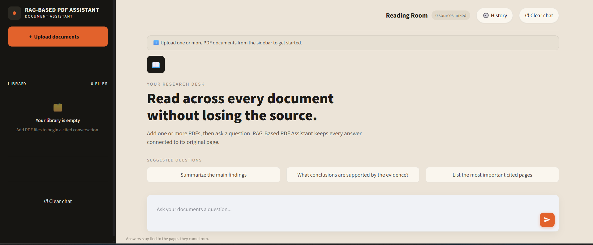
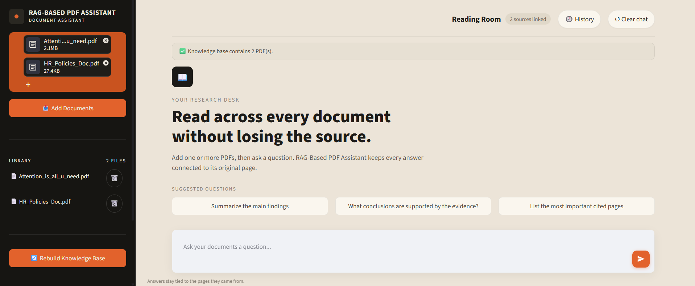
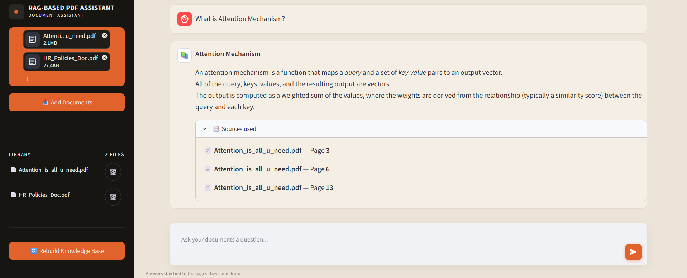

# 📚 RAG-Based PDF Assistant

An AI-powered question-answering app that lets you chat with the contents of your PDF documents. Built with **Retrieval-Augmented Generation (RAG)** — the app retrieves the most relevant passages from your documents and uses an LLM to answer questions grounded strictly in that context, reducing hallucination compared to asking an LLM directly.

---

## 🚀 Live Demo

Try it here: **[Try the RAG-BASED PDF ASSISTANT Live](https://ragbasedapplication-gsxdrjbmbhbk5fwjwjdzqs.streamlit.app/)** 

> No install needed — upload a PDF and start asking questions right in the browser.

---

## 🖥️ Screenshots

**Research desk — empty state with suggested prompts to get started**



**Multiple documents uploaded at once — the assistant retrieves across your whole library**



**Grounded answer with page-level source citations**



**Session history — revisit any past question and its answer**


---

## 📌 Overview

Large language models are powerful but don't know about your private or domain-specific documents. This project solves that by combining:

- **Document retrieval** — splitting PDFs into chunks, embedding them, and storing them in a vector database (FAISS)
- **Semantic search** — finding the most relevant chunks for a given question
- **Generation** — passing that context to a fast LLM (via Groq) to produce a grounded answer

The result is a Streamlit chat interface, styled as a "Reading Room," where answers come **only from the source documents you upload**, complete with the exact document and page each answer was pulled from.

---

## ✨ Features

- 📤 **Upload PDFs directly from the sidebar** — no external links required
- 📚 **Supports multiple documents at once** — upload as many PDFs as you like and the assistant retrieves and cites across your entire library, not just one file
- ➕ Add or remove individual documents at any time; the affected index is invalidated automatically
- ✂️ Splits documents into overlapping chunks for better retrieval accuracy
- 🧠 Generates embeddings using a HuggingFace sentence-transformer model
- ⚡ Stores and searches embeddings with **FAISS** for fast local vector search
- 🤖 Uses **Groq's `openai/gpt-oss-20b`** model for near-instant, high-quality answers
- 🔒 Answers are constrained to the retrieved context only — no made-up facts
- 📎 **Page-level source citations** shown under every answer, so you can trace it back to the original document and page
- 🔄 **Conversation-aware query rewriting** — follow-up questions like "what about the second one?" are automatically rewritten using chat context before retrieval
- 💡 **Suggested questions** to help you get started instantly
- 🕘 **Session history panel** — revisit and re-open any previous question/answer pair without losing your current conversation
- 🔁 **One-click "Rebuild Knowledge Base"** to re-index after adding or removing documents
- 🚀 Vector index is cached locally so repeated questions are fast

---

## 🏗️ How It Works

```text
Upload PDFs via sidebar
    ↓
Load & parse documents (PyPDFLoader)
    ↓
Split into overlapping text chunks
    ↓
Generate embeddings (sentence-transformers)
    ↓
Store in FAISS vector database
    ↓
User asks a question
    ↓
Rewrite question using conversation history (if a follow-up)
    ↓
Retrieve top-k most relevant chunks
    ↓
Pass question + context to Groq LLM (openai/gpt-oss-20b)
    ↓
Display grounded answer + page-level sources in Streamlit
```

---

## 🗂️ Project Structure

```text
Rag/
├── app.py                    # Streamlit app: RAG pipeline, vector store, chat UI
├── requirements.txt          # Python dependencies
├── .env                       # GROQ_API_KEY (not committed)
├── .gitignore
├── docs/                      # Uploaded source PDFs (created at runtime)
├── faiss_db/                  # Local FAISS vector index (created at runtime)
├── ragenv/                    # Python virtual environment (not committed)
└── screenshots/                # Screenshots used in this README
    ├── Rag_Dashboard.png
    ├── Multiple_uploads.png
    ├── Findings.png
    └── conversation_history.png
```

---

## 🛠️ Tech Stack

| Component        | Tool / Library                                |
|-------------------|-----------------------------------------------|
| UI                | Streamlit                                      |
| LLM               | Groq API (`openai/gpt-oss-20b`)                |
| Embeddings        | HuggingFace `sentence-transformers`            |
| Vector store      | FAISS (CPU)                                    |
| Document loading  | LangChain (`PyPDFLoader`, text splitters)      |
| PDF parsing       | `pypdf`                                        |

---

## ▶️ How to Run Locally

### Step 1 — Clone the repository

```bash
git clone https://github.com/rabia020/RAG_Based_Application.git
cd RAG_Based_Application
```

### Step 2 — Create a virtual environment (recommended)

```bash
python -m venv venv
source venv/bin/activate      # On Windows: venv\Scripts\activate
```

### Step 3 — Install dependencies

```bash
pip install -r requirements.txt
```

### Step 4 — Add your Groq API key

This app calls the Groq API for answer generation, so you'll need a free API key from [console.groq.com](https://console.groq.com).

1. Create a `.env` file in the project root:
   ```env
   GROQ_API_KEY=your_actual_groq_api_key_here
   ```
2. Make sure this file is **never committed** — add it to `.gitignore`:
   ```
   .env
   ```

### Step 5 — Run the app

```bash
streamlit run app.py
```

The app will open at `http://localhost:8501`.

---

## 📥 Adding Your Own Documents

1. Open the sidebar and click **Upload documents**.
2. Select one or more PDF files, then click **Add Documents**.
3. If you later add, remove, or replace files, click **🔄 Rebuild Knowledge Base** in the sidebar to re-index the current document set.

Deleting a document from the **Library** list automatically invalidates the cached FAISS index so it's rebuilt from the remaining files on your next question.

---

## ⚠️ Notes

- The vector index (`faiss_db/`) is built once per document set and reused on future runs for speed — use **Rebuild Knowledge Base** after changing your documents.
- Answers are generated strictly from retrieved document context — if the documents don't contain relevant information, the model will say so rather than answering from general knowledge.
- Conversation history is kept for the current session only; use the **History** panel to jump back to any earlier answer, or **Clear chat** to start fresh.
- `allow_dangerous_deserialization=True` is required by FAISS's local load step; only load index files you trust (i.e., ones generated by this app).

---